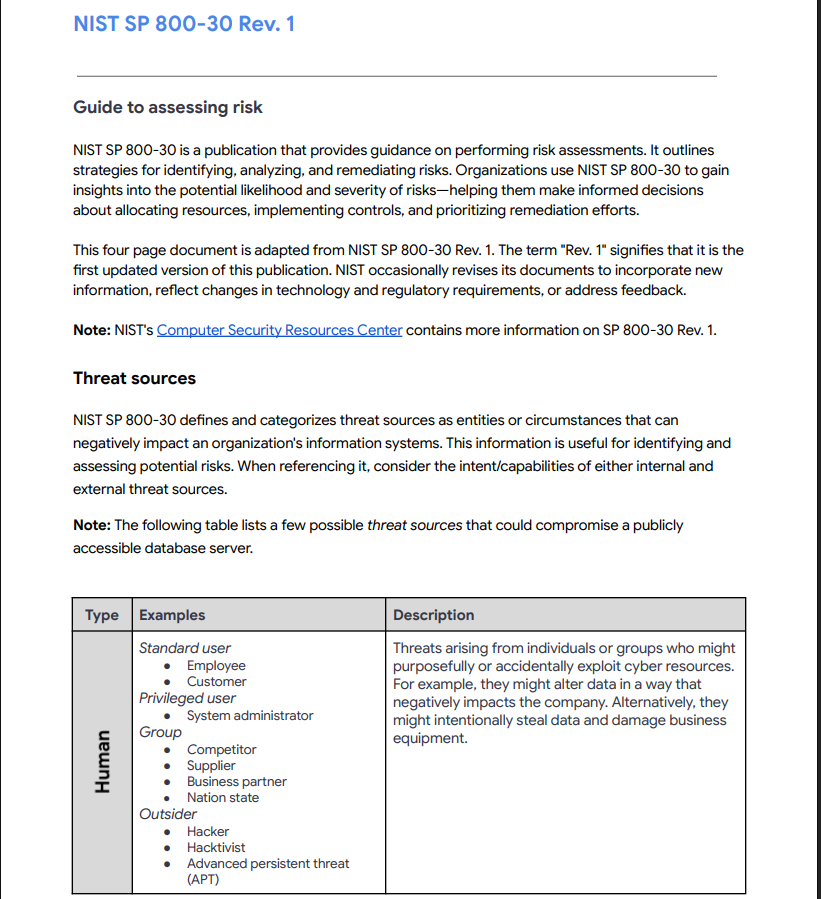
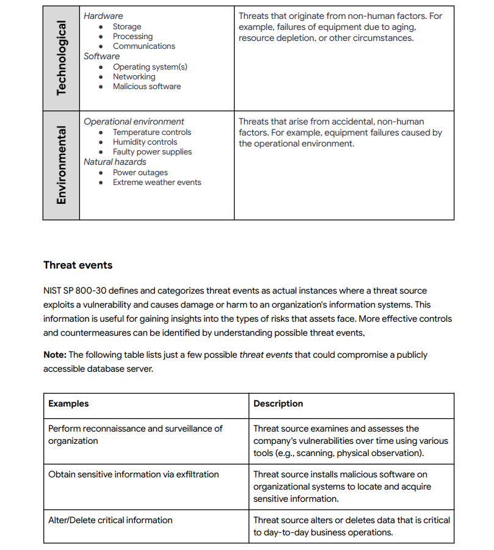
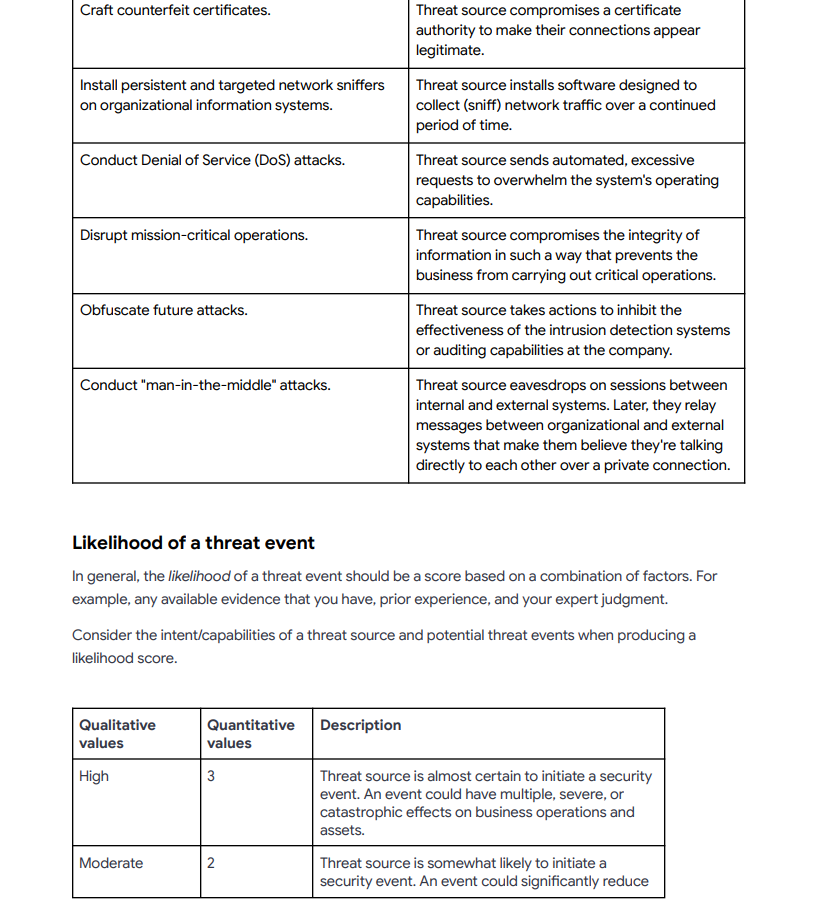
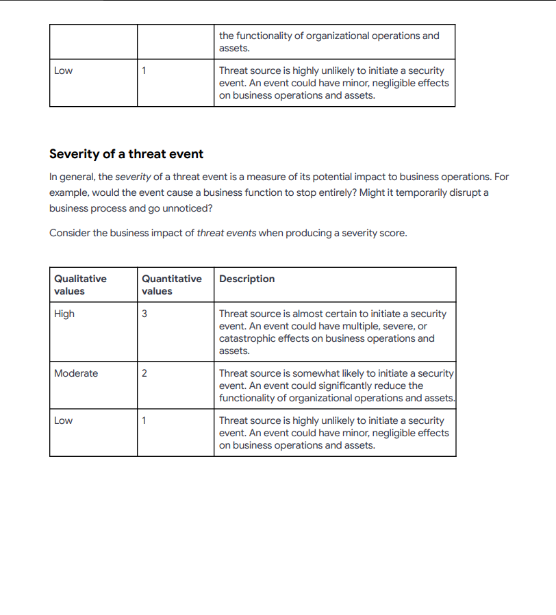
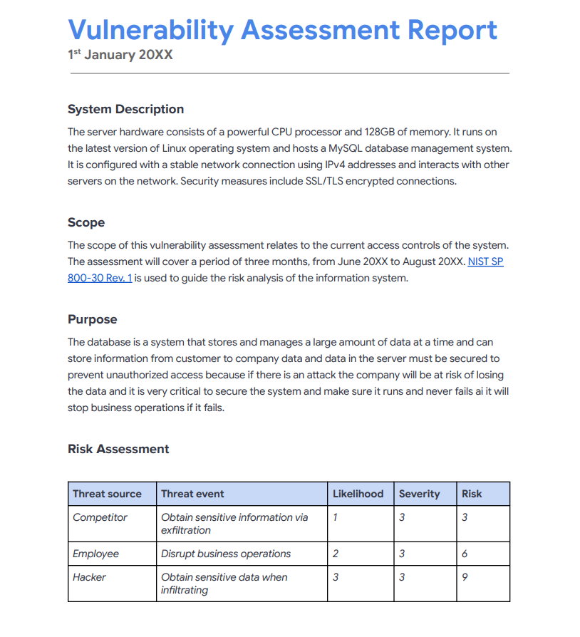
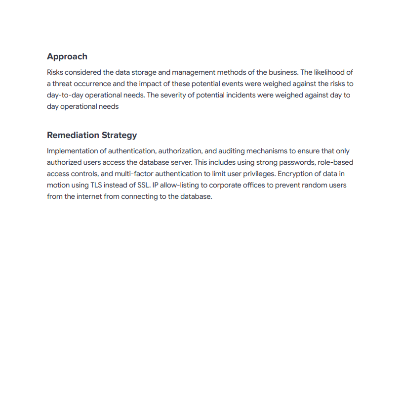

# vulnerable-analysis-of-a-business
Analyze a vulnerable system for a small business

## Scenario

### Review the following scenario. Then complete the step-by-step instructions.

You are a newly hired cybersecurity analyst for an e-commerce company. The company stores information on a remote database server, since many of the employees work remotely from locations all around the world. Employees of the company regularly query, or request, data from the server to find potential customers. The database has been open to the public since the company's launch three years ago. As a cybersecurity professional, you recognize that keeping the database server open to the public is a serious vulnerability.

You are tasked with completing a vulnerability assessment of the situation to communicate the potential risks to decision makers at the company. You must create a written report that explains how the vulnerable server is a risk to business operations and how it can be secured.

## Resources

I used the information i already had from the NIST SP 800-30 Rev. 1 to conduct my research
 
 
 
 

## Vulnerability Assessment Test

